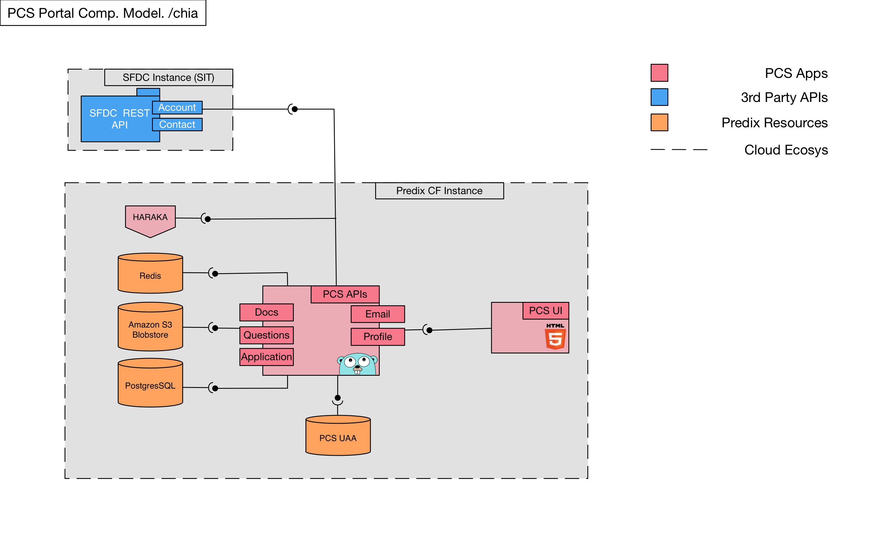
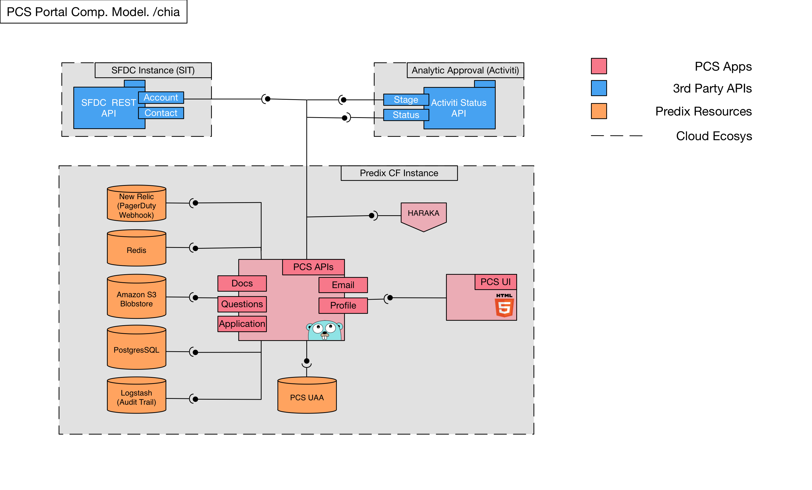
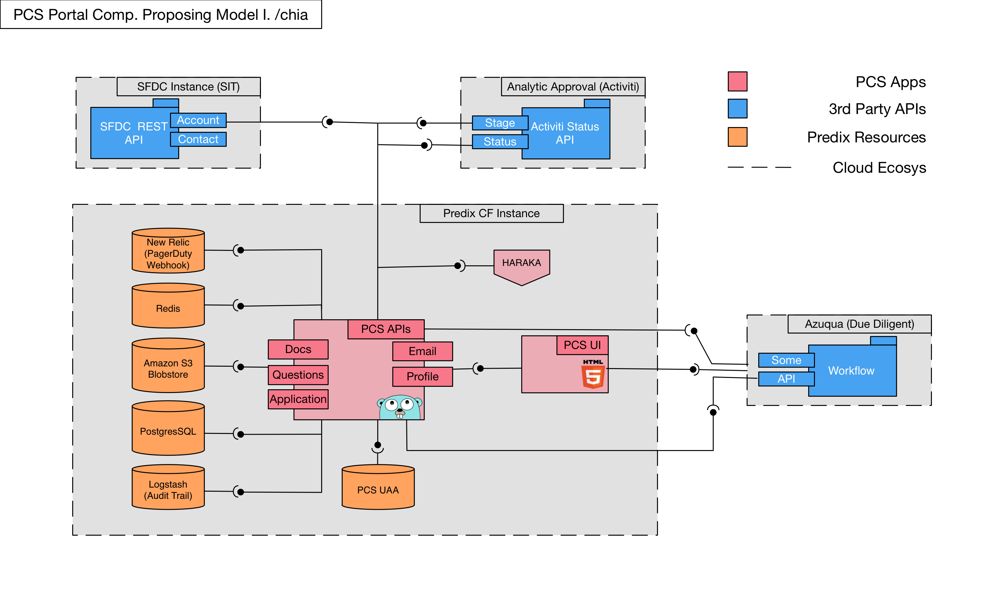
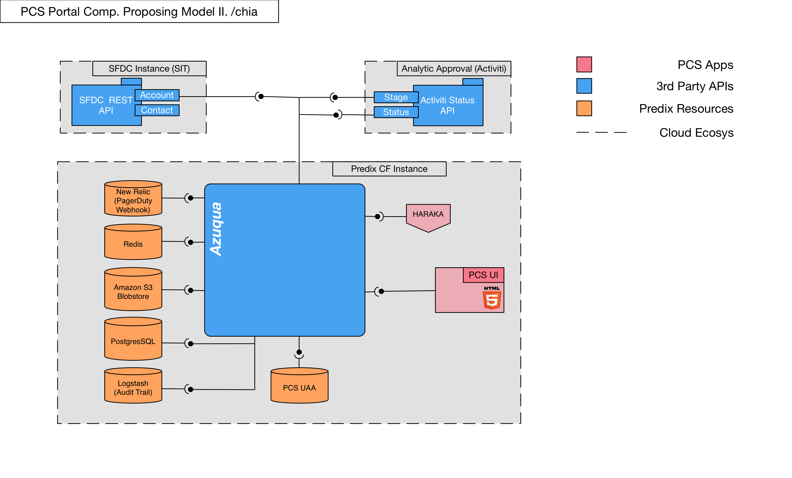
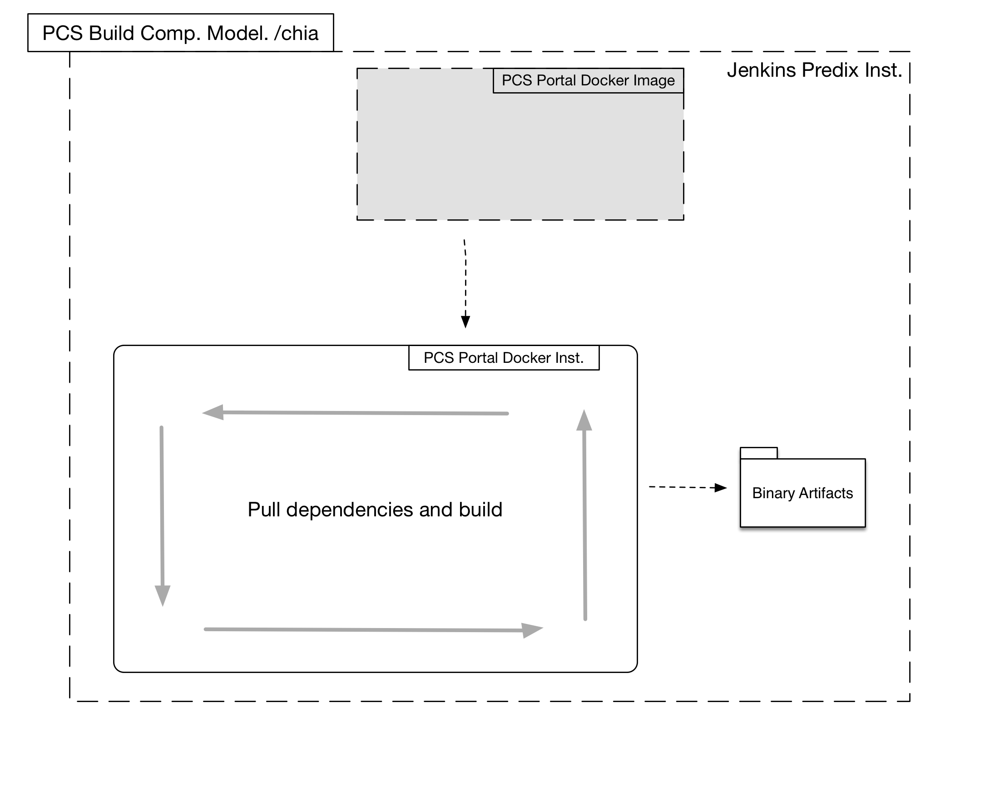
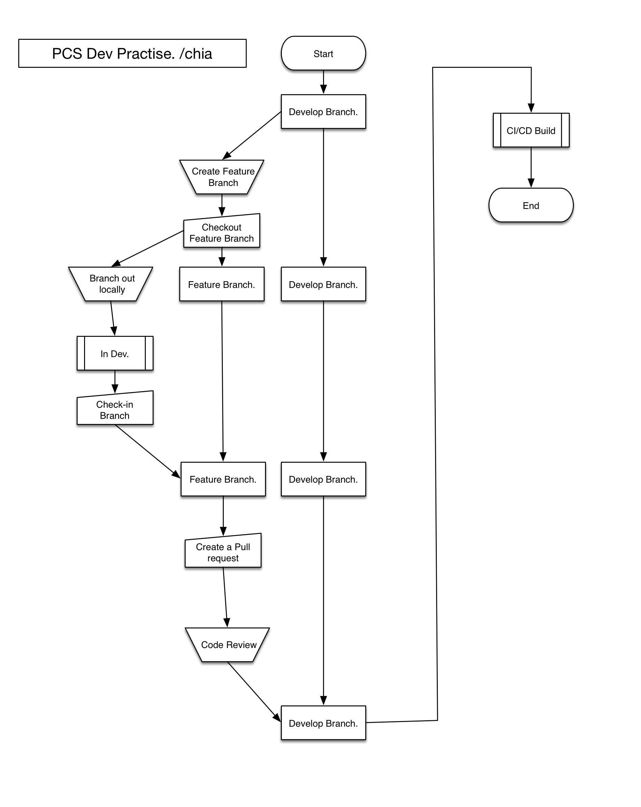

# catalog-onboarding-backend
 Catalog onboarding publishing service backend

## PCS Onboarding Portal SDK
Environment | URL | Build Status
--- | --- | ---
Development | https://pcs-backend-tokyo.run.asv-pr.ice.predix.io/v1/api/ | 
Staging | https://pcs-backend-osaka.run.asv-pr.ice.predix.io/v1/api/ | 
Production | https://pcs-backend-hokkaido.run.asv-pr.ice.predix.io/v1/api/ | 

## PCS Portal Architecture Diagrams

###Portal Composite Model

###Portal Composite Model With Future Predix Resources

###Portal Composite Model With Future Cloud Services

###Portal Composite Model With Azuqua?

###Portal Composite Model With correct Azuqua usage

###Portal Build Process

###Portal Dev Practise

###Portal CI/CD Pipeline

